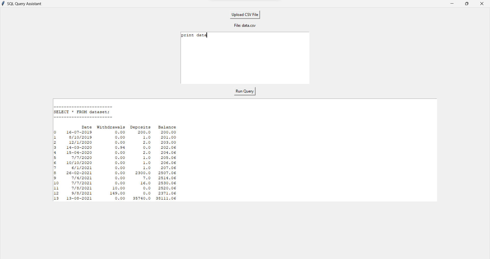

# [SQL Query Assistant: Simplify Your Data Analysis](./SQLEase.exe)

---

## Introduction:

The SQL Query Assistant is a powerful desktop application designed to streamline the process of writing SQL queries for data analysis tasks. Whether you're a data scientist, analyst, or database administrator, this tool provides a user-friendly interface to interactively build and execute SQL queries on your datasets.

## Key Features:

1. **Upload CSV Files**: Easily upload your datasets in CSV format, making it convenient to work with various data sources.

2. **Interactive Query Building**: The application allows you to input SQL queries directly or interactively build them within the interface, providing real-time feedback and suggestions.

3. **AI-Powered Assistance**: Powered by OpenAI's GPT-3.5 model, the assistant provides intelligent suggestions and completions for your SQL queries, enhancing productivity and reducing errors.

4. **Error Handling**: Robust error handling ensures that even complex queries are executed smoothly, with detailed error messages provided in case of any issues.

5. **Data Visualization**: Integration with popular Python libraries like Pandas allows for seamless data visualization, enabling users to gain deeper insights from query results.

6. **Cross-Platform Compatibility**: The application is built using Python and Tkinter, making it compatible with Windows, macOS, and Linux operating systems.

## How It Works:

1. **Upload Dataset**: Start by uploading your dataset in CSV format using the provided button. The application supports a wide range of datasets, making it suitable for various use cases.

2. **Write or Input Query**: Once the dataset is uploaded, you can either manually write your SQL query or input keywords and let the AI-powered assistant generate a query for you. The assistant provides helpful suggestions and completions, making query writing faster and more efficient.

3. **Execute Query**: After finalizing your query, simply click the "Run Query" button to execute it. The application handles the execution process seamlessly, providing you with the query results in a clear and organized format.

4. **Error Handling**: In case of any errors during query execution, the application provides detailed error messages, helping you quickly identify and resolve issues.

5. **Visualize Results**: Utilize the integrated data visualization capabilities to create insightful charts and graphs based on your query results, facilitating easier data interpretation and analysis.
6. Certainly! Here's an updated section including a sample data section:
Certainly! Here's an updated section including a sample data section and a link to download the CSV file:

## Sample Data:

To help you get started with the SQL Query Assistant, here's a sample dataset that you can use for testing and experimentation:

### Description:

The sample dataset provided below includes simulated financial transactions over time. Each row represents a transaction with the following attributes:

- **Date**: The date of the transaction.
- **Withdrawals**: The amount withdrawn from the account.
- **Deposits**: The amount deposited into the account.
- **Balance**: The remaining balance after the transaction.

You can download the sample dataset from the link below:

[Download Sample Dataset](./data.csv)

## Benefits:

- **Time Efficiency**: By automating the query writing process and providing intelligent suggestions, the SQL Query Assistant helps save time and effort, allowing users to focus on analysis rather than syntax.

- **Accuracy**: The AI-powered assistant reduces the risk of syntax errors and logical mistakes in SQL queries, ensuring accurate results and analysis.

- **User-Friendly Interface**: With its intuitive interface and interactive features, the application caters to users of all skill levels, from beginners to experienced SQL developers.

- **Enhanced Productivity**: By simplifying the data analysis workflow, the SQL Query Assistant enables users to complete tasks more efficiently, increasing overall productivity.

## Future Enhancements:

- **Support for Additional Data Formats**: Expand the application's compatibility to support other data formats such as Excel files, JSON, and databases like MySQL and PostgreSQL.

- **Advanced Query Optimization**: Implement advanced query optimization techniques to further improve query performance and efficiency.

- **Customization Options**: Introduce customization options for the AI assistant, allowing users to fine-tune its behavior and preferences according to their specific requirements.

## User Interface:

## Conclusion:

The SQL Query Assistant empowers users to perform data analysis tasks with ease and efficiency, thanks to its intuitive interface, AI-powered assistance, and robust features. Whether you're a data enthusiast exploring datasets or a professional analyst working with large-scale data, this tool is designed to simplify your workflow and elevate your data analysis experience.

Download the SQL Query Assistant today and revolutionize the way you interact with your data!

[Download SQL Query Assistant](./SQLEase.exe) 
